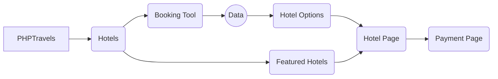

# PHPTravels.com
PHPTravels.com offers now hotel booking functionality. This functionality can be accessed from top main navigation menu. 
Based on the notes in our documentation, we will try 3 scenarios to test the functionality. 

## 1 Scenario Charter
### Coverage
Areas:
Test functionality of Hotel Booking Tool
Strategy: 
Book a hotel using the booking tool with data provided below, any other information leave default values, click on the first hotel option, proceed to payment and confirmation page. 
 
### Data
Email: user@phptravels.com 
Password: demouser
Check-in date: current date
Check-out date:  current date + 3 days
Payment Option: Later
### Test Notes
When I started inserting the city in the booking tool, I received all possible matches that started with the same three characters. 
I left default information for the travellers section. 
I couldn't complete a booking after 5 changes of dates 
### Bugs
1. Sometimes the city field won't get filled correctly. 
2. Travellers' section allows you to leave all the information blank. We should have a message to provide at least two fields. 
3. For the checkout dates, I noticed some previous dates are grayed-out; however, some other days are blue.  
4. Search button won't always work correctly. 
5. Hotels with no available rooms are showing up as results
## 2 Scenario Charter
### Coverage
Areas:
Test functionality of Featured Discount Hotel
Strategy: 
Book a hotel by clicking on any option with a discount promotion
 
### Data
Email: user@phptravels.com 
Password: demouser
Check-in date: current date
Check-out date:  current date + 3 days
Payment Option: Later
### Test Notes
I clicked the Islamabad Marriott Hotel which it advertises a 15% discount. I selected a room with price of $110 USD. Proceeded to pay with Pay Later option and got a reservation number, afterwards.
### Bugs
1. Price in the carrousel said $100 USD. But when I clicked on the hotel, the hotel page did not have a $100 room. 
2. No discount was given. The discount should be displayed in the Payment Page - Details. 
## 3 Scenario Charter
### Coverage
Areas:
Test functionality of Booking Hotel Tool and Cancel Reservation 
Strategy: 
Book a hotel by clicking on any option with a discount promotion, proceed to payment and confirmation page. 
Cancel the reservation.
 
### Data
Email: user@phptravels.com 
Password: demouser
Check-in date: current date
Check-out date:  current date + 3 days
Payment Option: Later
### Test Notes
I clicked the Malmaison Manchester which it advertises a 10% discount. I selected a room with price of $23 USD. Proceeded to pay with Pay Later option and got a reservation number, afterwards.
Once in the Confirmation page, I clicked Request Cancellation at the bottom of the page and proceeded with the flow. 
A message shows up at the bottom of the page that says cancellation was sent successfully. 
### Bugs
1. Price in the carrousel said $20 USD. But when I clicked on the hotel, the hotel page did not have a $20 room. 
2. No discount was given. The discount should be displayed in the Payment Page - Details. 
3. After cancelling reservation, the status of the reservation won't update to cancel. It stays on "Pending".
